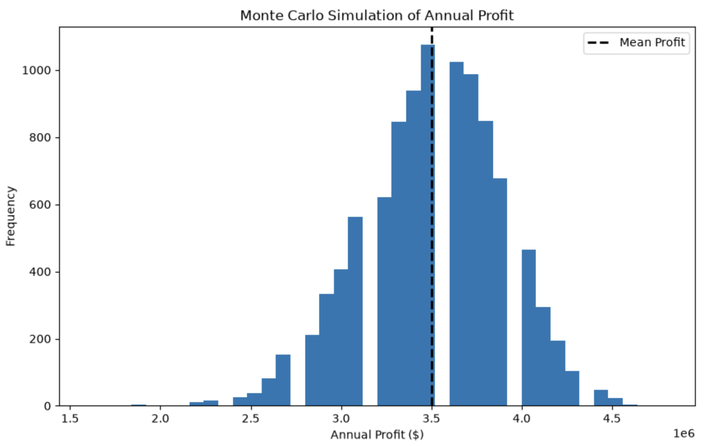
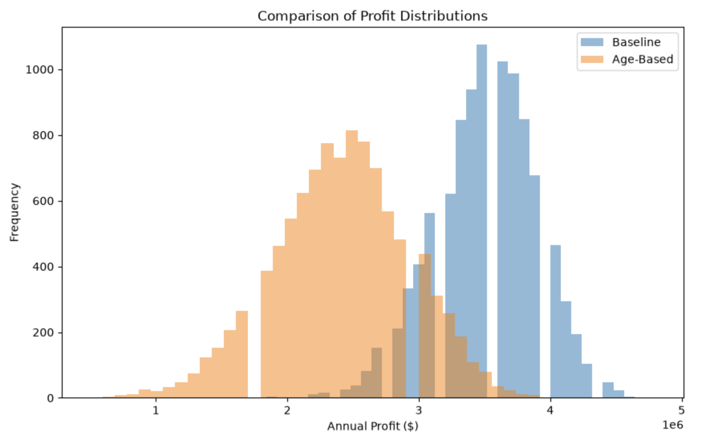
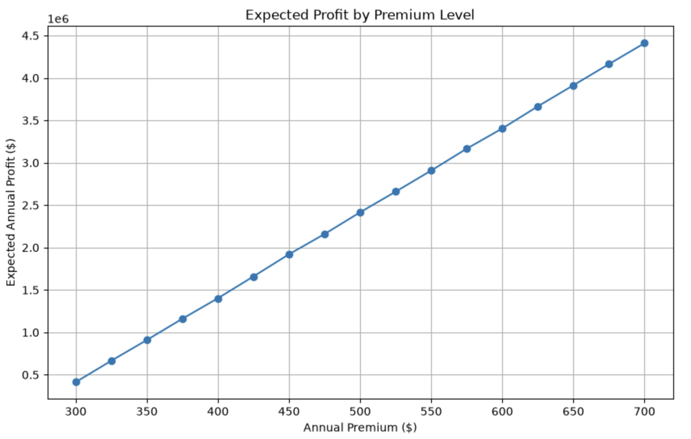

# Life Insurance Portfolio Risk & Pricing Simulator

A Monte Carlo simulation developed in Python to model the profitability and risk of a term life insurance portfolio under uncertain mortality outcomes.

This project demonstrates how probabilistic modeling can support insurance pricing, portfolio risk assessment, and business decision-making.

---

## Project Overview

Insurance companies make pricing decisions under uncertainty. Rather than relying on a single expected outcome, Monte Carlo simulation allows thousands of possible scenarios to be evaluated, providing insight into both expected profitability and financial risk.

This project builds a progressively more realistic insurance model by:

- Simulating a portfolio of 10,000 life insurance policies
- Modeling annual mortality using probability distributions
- Comparing a baseline model with an enhanced age-based risk model
- Evaluating pricing strategies through premium sensitivity analysis
- Visualizing profit distributions and key portfolio metrics

---

## Features

- Monte Carlo simulation (10,000 scenarios)
- Binomial probability modeling
- Age-based mortality assumptions
- Portfolio risk analysis
- Premium optimization
- Sensitivity analysis
- Statistical summaries
- Data visualization using Matplotlib

---

## Technologies

- Python
- NumPy
- Pandas
- Matplotlib
- Jupyter Notebook

---

## Repository Structure

```
LifeInsurancePortfolioRiskPricingSimulator/
│
├── MonteCarlo_LifeInsurance.ipynb
├── README.md
└── images/
```

---

## Example Outputs

The notebook includes:

- Distribution of annual portfolio profit
- Comparison of baseline and enhanced models
- Premium sensitivity analysis
- Statistical summaries
- Business conclusions

---

## Sample Visualizations







---

## Skills Demonstrated

- Monte Carlo Simulation
- Probability & Statistics
- Financial Modeling
- Risk Analysis
- Python Programming
- Data Visualization
- Decision Support Modeling

---

## Future Improvements

Potential extensions include:

- Published actuarial mortality tables
- Multi-year policy projections
- Policy lapses and cancellations
- Investment income modeling
- Inflation and discounting
- Reinsurance structures
- Optimization techniques for premium pricing
